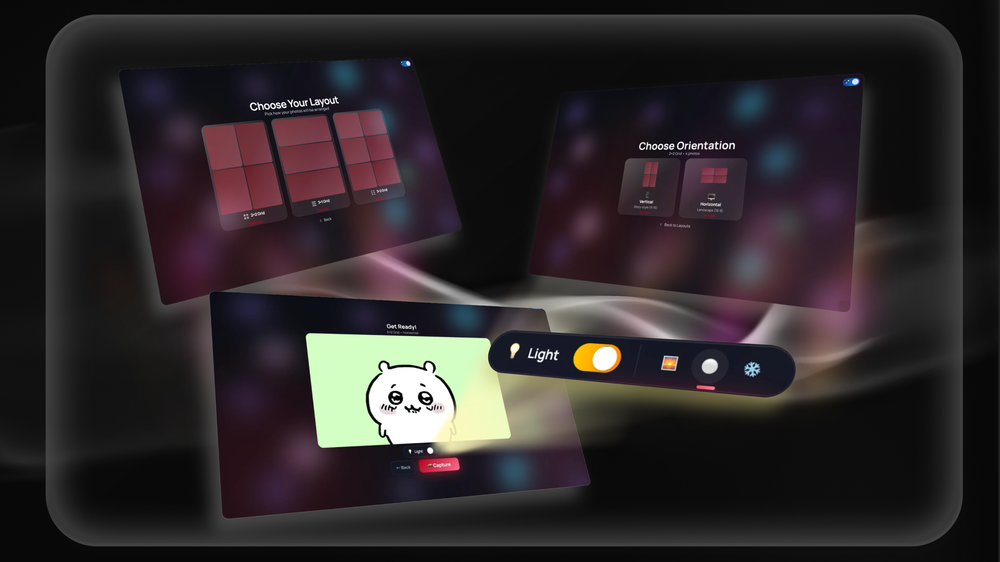

# SNAP

SNAP is an in-browser digital photobooth that captures multi-shot layouts, lets users decorate them with backgrounds and stickers, and exports a finished strip — all locally, with no backend required.

**6 layouts • 100+ stickers • 50+ backgrounds • Zero backend**

**[Live Demo](https://snapdigital.vercel.app)**

---
<p align="center">
  
  
  
</p>

---

## Why I Built This

Inspired by classic photobooths and Snapchat's camera-first philosophy, I wanted to create a modern, web-based alternative that respects user privacy. Every photo stays on your device — no uploads, no tracking, no servers.

---

## Features

### Capture
- Multi-shot layouts: 2×2, 3×1, 3×2
- Orientation-aware exports (vertical and horizontal)
- Front-facing mirrored camera preview
- Countdown timer, flash overlay, and ring-light glow
- Progress indicators, retake, cancel, and reset flows
- One-time camera clean reminder stored per session

### Edit
- Canvas-based preview matching final export dimensions
- Solid, scene, and pattern backgrounds
- Sticker library with drag, rotate, resize, and delete controls
- Responsive editor with mobile-friendly layout

### Export & Experience
- High-resolution PNG export
- Dark mode with persisted preference
- Animated gradient background and glassmorphic theming
- Fully client-side processing

---

## User Flow
```
Landing → Layout → Orientation → Capture → Preview → Edit → Export
```


## Tech Stack

- React 19 with Vite 7
- Tailwind CSS 4 with custom design tokens
- react-moveable for drag, rotate, and resize controls
- Browser APIs:
  - MediaDevices (camera access)
  - Canvas 2D (preview and export)
  - localStorage and sessionStorage

---

## Getting Started
```bash
# Clone the repository
git clone https://github.com/yourusername/snap.git
cd snap

# Install dependencies
npm install

# Start development server
npm run dev
```

---

## Project Structure
```
src/
├── App.jsx
├── components/
│   ├── AnimatedBackground.jsx
│   ├── Editor.jsx
│   ├── Landing.jsx
│   ├── LayoutSelector.jsx
│   ├── OrientationSelector.jsx
│   ├── PhotoBooth.jsx
│   ├── Preview.jsx
│   └── ThemeToggle.jsx
├── hooks/
│   ├── useCamera.js
│   ├── useLazyImage.js
│   └── useTheme.jsx
├── lib/
│   ├── assetCategories.js
│   └── layouts.js
├── index.css
└── main.jsx

public/assets/
├── backgrounds/
│   ├── scenes/
│   └── patterns/
└── elements/

scripts/
└── compress-images.js
```

## Architecture Notes

- Central stage flow manages transitions between capture, preview, and editing
- Layout and orientation behavior defined through configuration helpers
- Camera lifecycle and permissions handled via a dedicated hook
- Canvas used for both preview rendering and final export
- Editor stores element positions as percentages for consistent scaling

---

## Privacy

All processing stays entirely in the browser. Camera streams, captures, previews, and exports never leave the device.

Local persistence is limited to:
- Theme preference (localStorage)
- One-time camera reminder flag (sessionStorage)

**No analytics, tracking, or network requests are performed.**


## Future Work

- Text tool with font and color controls
- Additional export presets and quality options
- Session persistence for re-editing
- Multi-camera and input source selection

---

MIT © Gechleng Lim
